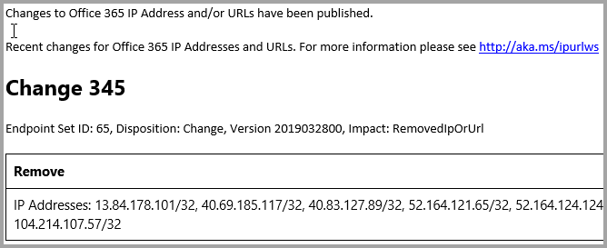
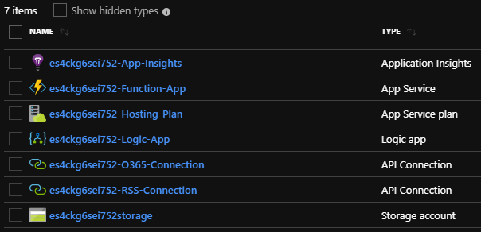
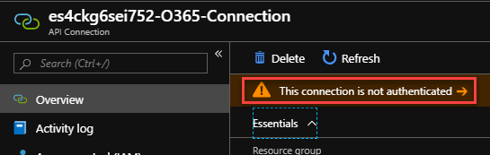
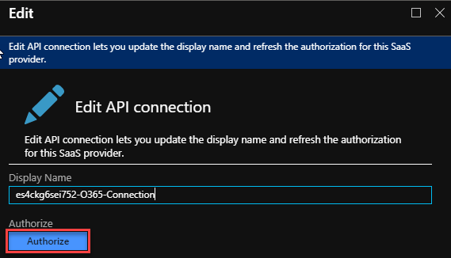
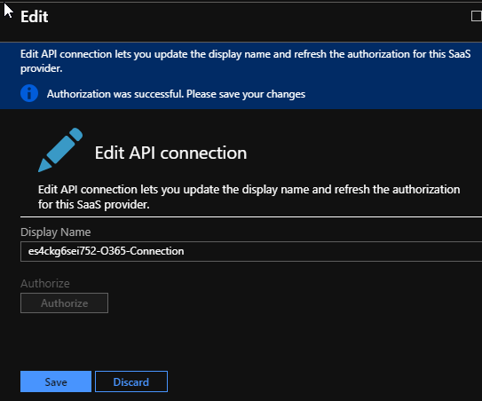
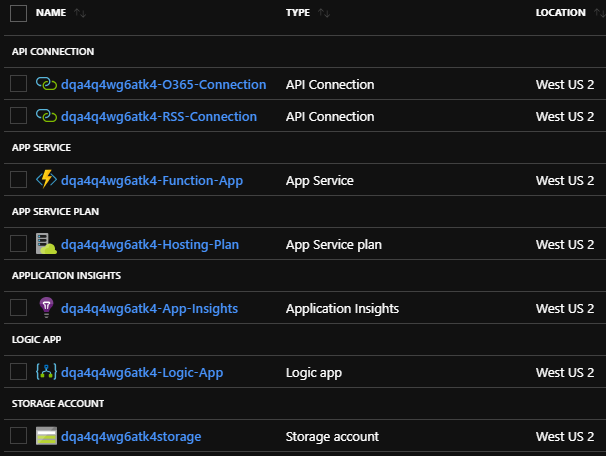
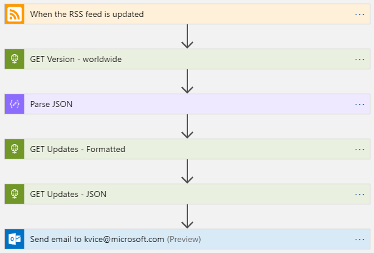

# Office 365 Update Notification (v1.2)

+ **Time to deploy**: 2 minutes
+ **Cost**: ~$4.00 per month

The **Office 365 Update Notification** template provisions a set of Azure resources that sends email notifications to a specified Office 365 email address when updates are published to the [Office 365 Endpoints RSS feed](https://endpoints.office.com/version/worldwide?clientRequestId=b10c5ed1-bad1-445f-b386-b919946339a7&allVersions=true&format=RSS). You can specify the Office 365 instance for which you want to be notified (i.e. Worldwide, China etc.).

**NOTE**: You must specify an Office 365 email account for the solution to work without modification.

## Usage

Deploying the solution is very simple, and no further configuration is required. However, you must authenticate with your Office 365 account before the solution can send emails to the email address you specified as described below.

**IMPORTANT**: This template can only be deployed to certain locations. See the [Known issues](https://github.com/maxskunkworks/dev/tree/master/O365-Endpoints-Notifications#known-issues) section for details.

1. Click the **Deploy to Azure** button to open the _Custom deployment_ blade in the Azure portal.

    a. In the _BASICS_ section, choose the subscription, resource group and location for the deployment.

    b. In the _SETTINGS_ section, in the **Notification Email** field, enter the email address for notifications.

    c. In the **Instance** field, use the drop-down menu to choose the instance for which you want to receive notifications. Unless you know you need a different instance, use the default setting of **worldwide**.

    When complete, click **Purchase**. Deployment should only take a couple of minutes. Next, you need to authenticate the O365 API connection to your Office 365 tenant.

2. In the Azure portal, navigate to the resource group, and click on the API Connection object named **<_unique_prefix_>-O365-Connection**.

    

3. In the _API Connection_ blade, click **This connection is not authenticated**.

    

4. In the _Edit_ blade, click **Authorize**.

    

5. In the authentication window that pops up, enter your Office 365 credentials. This experience differs depending on your browser and Office 365 tenant settings.

6. You should see the message _"Authorization was successful"_, and the **Authorize** button will be greyed out. Click **Save** to save your authorization token for future use.

    

The Office 365 authorization should be good for one year, at which point you will need to return to the O365 API Connection object and reauthorize the connection.

### Testing the solution

The logic app is triggered when a new RSS article is published. This only occurs one or two times a month so it's important to be able to have some means to test the solution. You can use the test procedure in [Step 5 – Testing and troubleshooting the flow](https://github.com/pandrew1/Office365-IPURL-Samples/tree/master/FlowNotifications#step-5--testing-and-troubleshooting-the-flow) in the [manual deployment guide](https://github.com/pandrew1/Office365-IPURL-Samples/tree/master/FlowNotifications) as a guide, substituting references to _Microsoft Flow_ with the **Logic app** in your solution. Microsoft Flow is built on the Azure Logic App feature, so the process is very similar.

## Solution overview and deployed resources

The following resources are deployed as part of the solution:

+ **API Connections**: Connects the solution to the specified Office 365 email account and the Office 365 IP and URL RSS feed.
+ **App Service**: The App Service function app converts the JSON output of endpoint updates to human-readable tables to make notification emails easier to read.
+ **App Service plan**: Web services to support the app service.
+ **Application Insights**: Provides monitoring and logging for solution components.
+ **Logic app**: Triggered by updates to the Office 365 Endpoints RSS feed, the logic app contains the workflow that notifies your specified email address when updates to the Office 365 endpoints are published. The notification email body contains the updates in human-readable format, and the JSON file attachment contains the updates in raw JSON format.
+ **Storage account**: Storage for log files and usage/diagnostics data.

The image below shows the resources deployed by the template. Note the 13-digit unique prefix for each object.

  

The image below shows the logic app workflow in designer view. The name of the **GET Version - ...** action shows the specified instance, and the name of the **Send mail to ...** action contains the specified notification email address.

  

## Solution notes

+ You can modify the logic app with additional functionality, such as adding an approval process or additional outputs targeted for your organization's particular workflow for updating Office 365 endpoints.
+ You can use a non-Office 365 email address by modifying the logic app post-deployment with a different email action instead of the Office 365 _Send Email_ action.
+ See [Creating a Microsoft Flow to email yourself when an Office 365 IP/URL change occurs](https://github.com/pandrew1/Office365-IPURL-Samples/tree/master/FlowNotifications) for additional solution details and procedures for manually building the solution.
+ You can get detailed realtime information about your function app from the Kudu service at 'https://\<_unique-prefix_>-function-app.scm.azurewebsites.net/'.

## Known issues

+ The resource type _Microsoft.Insights/components_ is only supported in certain locations as of the last update to this template. To avoid deployment failures, deploy the template to one of the following locations:

  + East US
  + South Central US
  + North Europe
  + West Europe
  + Southeast Asia
  + West US 2
  + UK South
  + Canada Central
  + Central India
  + Japan East
  + Australia East
  + Korea Central
  + France Central
  + East US 2
  + East Asia

## See also

+ [Creating a Microsoft Flow to email yourself when an Office 365 IP/URL change occurs](https://github.com/pandrew1/Office365-IPURL-Samples/tree/master/FlowNotifications)
+ [Office 365 IP Address and URL Web service](https://aka.ms/ipurlws)

`Tags: Office 365 endpoints, Office 365 IP Address and URL Web service`
___
Developed by the **MARVEL Skunkworks Lab**

Authors:

+ Kelley Vice (kvice@microsoft.com)
+ Paul Andrew (pandrew@microsoft.com)

https://github.com/maxskunkworks

Last update: _8/6/2019_

## Changelog

+ **4/16/2019**: Original commit.
+ **4/17/2019**: Updated function build zip file, updated function resource.
+ **4/24/2019**: Tested successfully. Submitted for peer review.
+ **4/30/2019**: Confirmed end-to-end functionality. Updated images, added instance value to notification email. Added code to generate unique GUID for clientRequestId. Updated names of _get updates_ and _send email_ actions. Revised formatting in index.js.
+ **5/1/2019**: Added logic app action to fetch updates in JSON format, added JSON attachment to email. Added image showing the logic app workflow.
+ **6/11/2019**: Corrected logic app issue where trigger authentication was set to "unspecified" during deployment, causing trigger failures.
+ **8/6/2019**: Added logic app authentication parameter with value _ActiveDirectoryOAuth_.